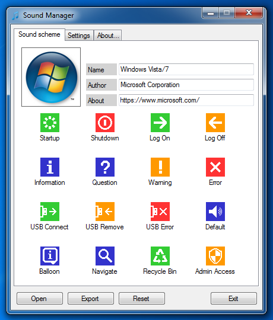

SoundManager is free software that makes it easy to create and share Windows sound schemes. All Windows versions from Windows XP SP3 to Windows 11 are supported. Requires [.NET 4.0](http://www.microsoft.com/en-us/download/details.aspx?id=17718) or greater.

* **Download:** Have a look at the [releases section](https://github.com/ORelio/Sound-Manager/releases) to get a build.
* **Sound schemes:** Check out the [sound schemes repository](https://github.com/ORelio/Sound-Manager-Schemes) :)

## Overview

The main UI allows managing the current sound scheme, as well as defining metadata:



Main features are the following:

* Load and test sound files for each event
* Define metadata such as thumbnail, author, description
* Export and import sound schemes using archive files
* Import sound schemes created with the [Sound applet](https://www.thewindowsclub.com/change-sounds-in-windows)
* Auto-convert sounds to WAV format (Windows 7+)
* Patch Windows Vista/7 startup sound (Admin required)
* Play startup/shutdown sounds on Windows 8 and greater
* Load proprietary soundpack archive files

## User Manual

See [User Manual](UserManual/Readme-En.txt) for more details on how to use the program.

## How it works

### The `SoundManager` sound scheme

SoundManager integrates into the system using the built-in sound scheme feature in Registry:
````
HKEY_CURRENT_USER\AppEvents\Schemes
````
The `SoundManager` scheme is automatically created on first launch, pointing to:
````
C:\Users\<USER>\AppData\Roaming\SoundManager\Media\
````
Sound files such as `Startup.wav`, `Shutdown.wav` and so on are placed here. Since they are automatically played by the system, the SoundManager app is not required to run once the sound scheme has been set, except if you want to restore the startup/shutdown sounds on Windows 8+ (see below).

SoundManager handles registry differences between Windows versions, such as the balloon sound which [does not play by default](https://winaero.com/blog/fix-windows-plays-no-sound-for-tray-balloon-tips-notifications/) on Windows 7/8 and changes again on Windows 10.

### Sound Archives

Sound archive files are simply Zip files having the `.ths` file extension:

````
SoundScheme.ths
 |- Scheme.ini
 |- Scheme.png
 |- Startup.wav
 |- Shutdown.wav
 \- <OtherSounds>.wav
````

SoundManager can associate itself with this file type to conveniently load sound schemes, and you can manually edit them using any file archive utility such as [7-Zip](https://www.7-zip.org/) or by renaming them to `.zip` while displaying [file extensions](https://www.thewindowsclub.com/show-file-extensions-in-windows), then using the built-in Windows utility.

### Windows Vista/7 startup sound

On Windows Vista and Windows 7, the startup sound is no longer customizable by the user, the corresponding WAV file being embedded in `C:\Windows\System32\imageres.dll` for [performance reasons](https://blogs.msdn.microsoft.com/e7/2009/02/18/engineering-the-windows-7-boot-animation/).

SoundManager can optionally [patch imageres.dll](https://www.sevenforums.com/tutorials/63398-startup-sound-change-windows-7-a.html) to update the startup sound:

* Ownership of `imageres.dll` is [transferred](https://helpdeskgeek.com/windows-7/windows-7-how-to-delete-files-protected-by-trustedinstaller/) from `TrustedInstaller` to `Administrators`
* If not already done, `imageres.dll` is backed up to `imageres.dll.bak`
* Existing `imageres.dll` is moved to `imageres.dll.old` since it is in use by the system
* `imageres.dll.bak` is copied to `imageres.dll` and its `WAV` resourse is updated

This feature requires administrator privileges. If enabled, SoundManager will show an [UAC](https://en.wikipedia.org/wiki/User_Account_Control) prompt on launch. Due to `imageres.dll` files being used by the system, SoundManager might not be able to patch the startup sound more than once between each system reboot.

### Windows 8+ startup and shutdown sounds

On Windows 8, the startup and shutdown sounds were removed for further [performance reasons](https://winaero.com/blog/how-to-play-the-logon-or-startup-sound-in-windows-8-1-or-windows-8/). SoundManager can emulate the playback of these sounds by launching a background process on logon:

* Process spawns an invisible window, mandatory for delaying system shutdown
* Process plays Startup or Logon sound and goes inactive
* On logoff, process wakes up and [sets up a ShutdownBlockReason](https://devblogs.microsoft.com/oldnewthing/20120614-00/?p=7373)
* Process determines if the Logoff or Shutdown sound should be played
* Sound is played, then ShutdownBlockReason is removed and the process exits

This is typically how `explorer.exe` was handling the thing on Windows 7, but you'll get yet another process sleeping in background, separate from `explorer.exe`. As such, this feature can be disabled entierely in the SoundManager settings.

Windows 11 reintroduced a startup sound but still lacks a shutdown sound, so the background proces approach is also available for this system version. Using the background process feature will automatically disable the built-in startup sound, which is not customizable.

## Build and compile

### setting up the environment

We will be using Visual C# 2010 Express for this exercise. It's free and allows SoundManager to run under Windows XP.
Note: While you can run SoundManager on Windows XP, you will need Windows Vista or higher to compile it, since it uses Task Scheduler 2.0 functions and the ShutdownBlockReason, which aren't supported on XP.
We will refer to the Visual Studio 2010 ISO as the DVD, since that's basically what it is.

1. Download Visual Studio 2010 Express [here](https://archive.org/details/vs-2010-express-1).
2. On Windows 10 and 11, simply opening the downloaded ISO file in Windows Explorer will automatically mount it as a virtual DVD drive. On earlier Windows versions, [WinCDEmu](https://wincdemu.sysprogs.org/) will do the trick.
3. Launch setup.exe, located inside the VCSExpress folder on the DVD.
4. Follow the on-screen instructions to install Visual C# 2010.

### Compiling

#### Notes

* This section assumes you already have the Sound-Manager repository git cloned or manually downloaded.
* In this section, %sm% refers to the main folder of the SoundManager repository. I.E. the folder where .git and readme.md are housed.
* If you don't see a Release folder after compiling, replace Release with Debug.

1. Navigate to %sm% and launch the SoundManager.sln file. If your system isn't showing file extensions, you won't see the .sln part of the filename. If VS 2010 doesn't open automatically, select Visual C# 2010 in the open with dialog.
2. Once VS 2010 is open, hit Shift+Control+B to build the SoundManager solution. Give the project a second or 2 to compile.
3. Assuming there were no errors during compilation, hit Alt + F4 to close VS 2010.
4. If everything worked properly, you should see SoundManager.exe in %sm%\SoundManager\bin\Release and DownloadSchemes.exe in %sm%\DownloadSchemes\bin\Release.
5. Copy the following items into %sm%\SoundManager\bin\Release.

  * %sm%\SoundManager\Lang
  * %sm%\UserManual\Readme-En.txt
  * %sm%\UserManual\Readme-Fr.txt
  *%sm%\DownloadSchemes\bin\Release\DownloadSchemes.exe
6. Finally, check that everything's working by launching %sm%\SoundManager\bin\Release\SoundManager.exe.

## License

SoundManager is provided under
[CDDL-1.0](http://opensource.org/licenses/CDDL-1.0)
([Why?](http://qstuff.blogspot.fr/2007/04/why-cddl.html)).

Basically, you can use it or its source for any project, free or commercial, but if you improve it or fix issues,
the license requires you to contribute back by submitting a pull request with your improved version of the code.
Also, credit must be given to the original project, and license notices may not be removed from the code.